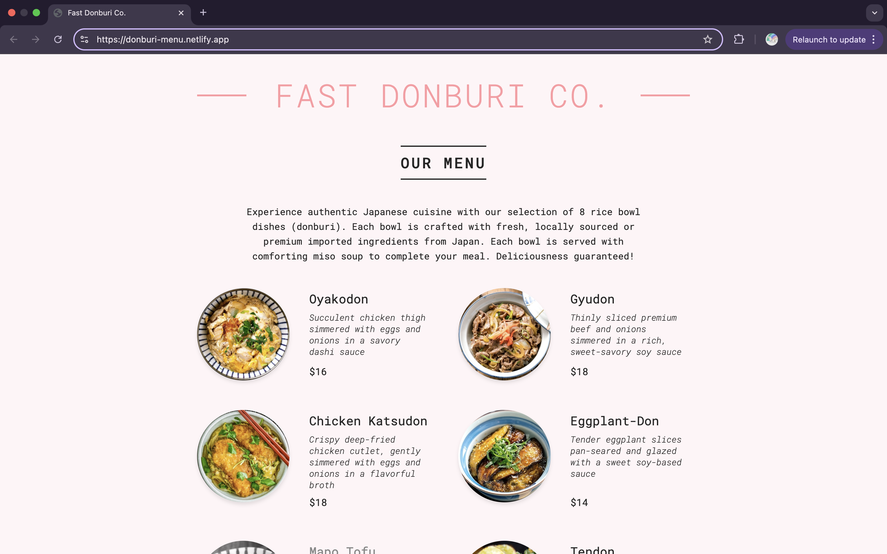
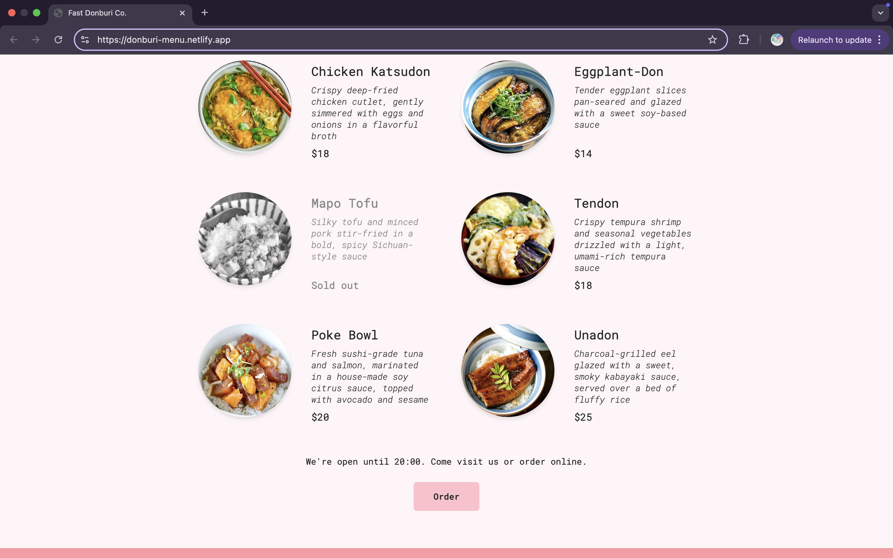

# Donburi Menu

Welcome to Donburi Menu, a simple and elegant React application that showcases a menu of authentic Japanese rice bowl dishes (donburi). This project demonstrates a clean, responsive design paired with interactive UI elements.

## Live Demo

Check out the live website: **[Donburi Menu](https://donburi-menu.netlify.app/)**
  
  

## Features

- **Responsive Design:** Looks great on both desktop and mobile.
- **Interactive UI:** Includes hover effects on images and smooth transitions.

## Installation & Setup

1. **Clone the repository:**
   ```bash
   git clone https://github.com/andyTuruu/donburi_menu.git
2. Navigate to your directory:
3. Install dependencies:
   ```bash
   npm install
4. Run the devlopment server:
   ```bash
   npm start
